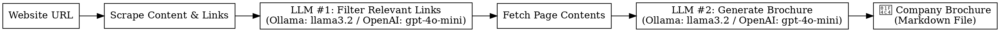

# Company Brochure Generator

This project automatically generates a short **company brochure** from a website.  
It scrapes the company’s landing page and relevant links (About, Careers, etc.), then summarizes them into a structured Markdown brochure.  

The system supports two backends for the LLMs:
- **Ollama** (local model inference, e.g., LLaMA 3.2)
- **OpenAI API** (cloud-based model, e.g., GPT-4o-mini)

---

## 📂 Project Structure

```
├── website.py                # Scrapes webpages and extracts text + links
├── ollamaLinksExtractor.py   # Extracts relevant links using Ollama
├── openAILinksExtractor.py   # Extracts relevant links using OpenAI
├── run_w_ollama.py           # Full pipeline with Ollama
├── run_w_open_api.py         # Full pipeline with OpenAI
├── requirements.txt          # Python dependencies
├── pipeline_diagram_two_llms.png   # Pipeline diagram (with 2 LLM stages)
```

---

## ⚙️ Installation

1. Clone this repository  
2. Create a virtual environment:
   ```bash
   python -m venv venv
   source venv/bin/activate   # macOS/Linux
   venv\Scripts\activate      # Windows
   ```
3. Install requirements:
   ```bash
   pip install -r requirements.txt
   ```

4. Add your API keys to a `.env` file (for OpenAI):
   ```
   OPENAI_API_KEY=sk-proj-xxxx
   ```

---

## ▶️ Usage

### Run with Ollama
```bash
python run_w_ollama.py
```

### Run with OpenAI
```bash
python run_w_open_api.py
```

Both scripts will:
1. Scrape the target website  
2. **LLM #1** filters the relevant links (About, Careers, etc.)  
3. Fetch contents of those links  
4. **LLM #2** generates a company brochure in Markdown format  
5. Save the result as `<CompanyName>_brochure.md`  

---

## 📊 Pipeline

The workflow uses **two LLM stages**: one for **link filtering** and another for **brochure generation**.  



---

## ✅ Example Output

After running the pipeline on `https://huggingface.co`, you’ll get a Markdown file like:

```
=== Generated Company Brochure ===

# Hugging Face

## About
...

## Careers
...
```

---
